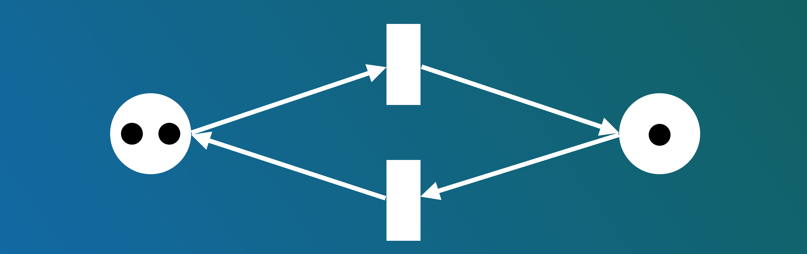
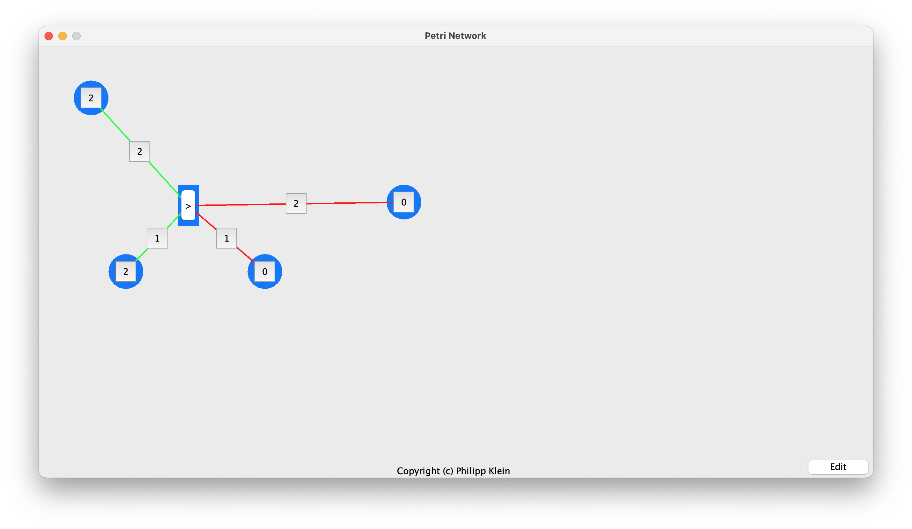
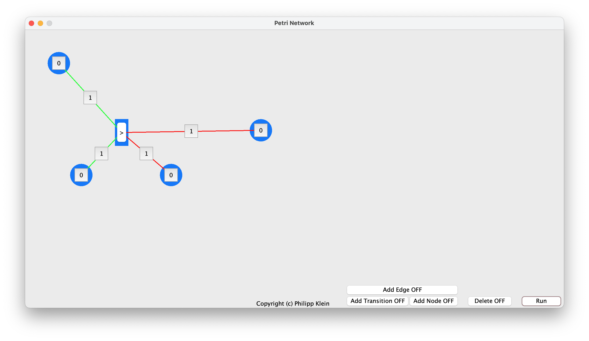

<h1>Petri Network</h1>
<i>Published on: Monday, 03.31.2025 </i>
<i>Languages: Java </i>
<i>Version: 1.0 </i>

[General Information](#General-Information) 
[How to use the application](#How-to-use-the-application) 

## General Information

This application allows you to create, view, and interact with Petri-Networks. The GUI was implemented using Java Swing.

When you launch the software in your IDE or via the JAR file, you'll find yourself in the main window. Here you can interact with the Petri-Network and fire the Transitions.

## How to use the application

In the bottom right corner, you’ll find an ‘Edit’ button that allows you to toggle between the standard (‘Run’) mode and the ‘Edit’ mode. Once you press the button, you have the following options:

<ol>
    <li><b>Delete</b>: you can effortlessly remove Nodes/Places, Transitions, and Edges by enabling delete mode and simply clicking on their weight button.</li>
     
    <li><b>Add Node/Place and Transition</b>: if those modes are active, just click with your mouse anywhere on the screen to create a Node/Place or Transition at this location.</li>
     
    <li><b>Add Edge</b>: to connect a Transition and a Node/Place, first press the weight button of either the Transition or the Node/Place to set the direction of the edge, then press the weight button of the other element. For visibility and usability reasons, Transitions and Nodes/Places can only have a one-way edge.</li>
     
</ol>
